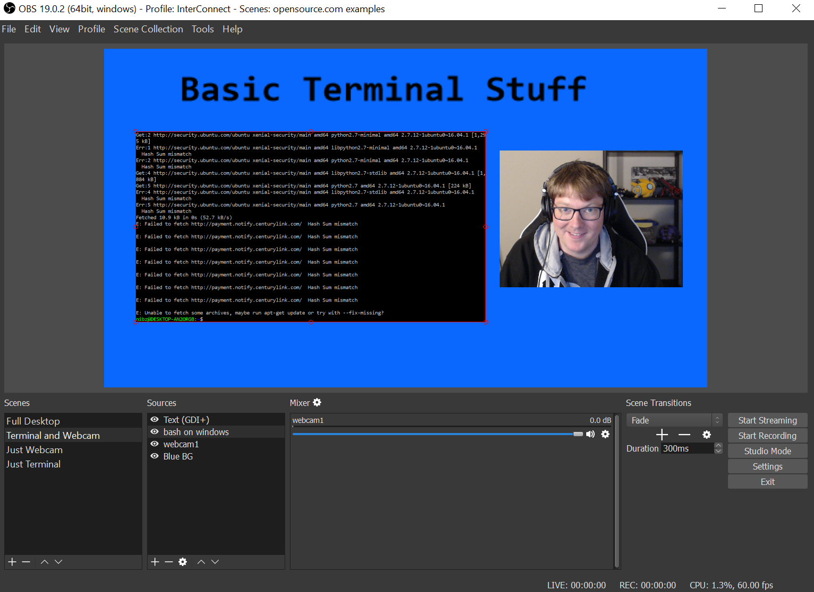

OBS is Open Broadcasting Software. It's latest version, OBS-Studio, is in now in version 19.0.2. Binary downloads are available for Mac and Windows, and repositories are available for a variety of Linux flavors.

## What is OBS-Studio

At it's most basic, OBS-Studio is software for recording the desktop. It can be used to make instructional videos or other screencasts. This has been possible in Linux for years using arcane ffmpeg scripts but OBS wraps that in a slick GUI.

Going further, OBS allows the user to record each window of the desktop environment separately. The user can then combine these windows into scenes. A scene can be constructed out of sources: application windows, static images, webcam feeds, and more. Each source can be positioned and layered to give the scene a polished look and feel.  

Figure 1: A basic scene with four sources, a blue background (bottom layer), a text source for the title, a terminal window being captured, and a webcam source of the author.

This is a very basic scene construction. The tool can be used (especially combined with other graphics software) to make beautiful and seamless scenes. The scenes can be switched from one to the other at the push of a button.

Figure 2: Gif of some basic scene switching. Quality losses are due to the giffing process.

One neat thing about OBS is that desktop recording is no longer tied to the state of the desktop. The windows can be arranged by the user in any way they desire, and OBS will only record the ones it is configured to record and will arrange them according to the scene layout.

OBS can create three kinds of output. It can take recordings as video files, in a variety of formats. It can stream the video output to a livestreaming service like twitch.tv or facebook live. Or it can write the video output to a dedicated monitor or projector. All three of these outputs are very useful.

Recording to disk is useful for instructional, high quality videos that will be edited later in video editing software then uploaded to a video hosting service like YouTube or Vimeo.

Streaming to a livestreaming service is probably the most common use case for OBS, a huge percentage of twitch's streaming population uses OBS to stream. OBS (and twitch) use the RTMP protocol and this is why it is possible to use a completely open toolkit to broadcast on twitch. Because OBS is open source, support for new services is being added all the time.

Displaying the output directly on to a monitor is a less used but very powerful output method of OBS. Scene switching, graphical overlays, smooth transitions and more are all available as hotkeys to whoever is in control of the OBS application. There are many cases where an audience is watching a projector or TV screen and the production could benefit from the professional touch that OBS enables. Examples are an in-person esports tournament or a conference keynote.

## Who uses OBS

Streaming to twitch.tv is extremely popular. Watching these streams is also popular. At any given time, close to a million people are watching live, while thousands are streaming. Mostly, they stream video games. These games aren't just on the computer. Capture cards and capture devices from vendors like Elgato let streamers capture and stream from virtually any device, from the original Nintendo to the Playstation 4 to handhelds. OBS is such a powerful player in the scene that Elgato and other vendors create [excellent doucmentation](https://gaming.help.elgato.com/customer/en/portal/articles/2768069--elgato-stream-deck-%E2%80%93-obs-integration-) on how to integrate their products with OBS.

## Where does OBS come from

OBS is developed by a small team working in the open. Most of the code has been written by jp9000/Jim. Several other people have made serious contributions to the project. The project has two very active IRC channels: '#obsproject' for user chat and support, and '#obs-dev' for developer chatter. Both of these IRC channels are on Quakenet, instead of the more common Freenode network. This illustrates how OBS forms it's identity as a piece of gaming software first and a piece of Free/Open Source second. OBS also has a very active forums on their main website. The forums is where users post plugins that they have created.

## Advanced features

One excellent plugin exposes a websockets server that can be used to control OBS through a webpage. Several clients have been made, and it is common for a streamer to use a second laptop or tablet to control OBS.

OBS is ready for real-time. OBS itself can render web resources directly onto the stream or read files from disk. This enables streamers to overlay recent tweets, channel chat, currently playing music, scores in games, the weather, and other notifications.

## What is different about OBS

OBS has a huge and engaged user base. It might be the highest for a project of it's size in FLOSS. This is a project with one main developer, a few other volunteers, and no one getting paid for their work. The official twitter account has 90,000 followers. For comparison, VideoLAN has been around much longer and has on 19k. The gimp might be a better comparison, since it is digital creative software, clocks in at 8k followers. To find FLOSS accounts with that kind of following we need to look at Linux (233k) and OpenStack(139k). OBS certainly doesn't have governance boards and million dollar conferences.

When DD-WRT first came out, one of the lines was 'turn you $50 router into a $5000 router.' The explanation was that with this piece of software you could get features that were only available in professional, expensive devices. This is essentially what OBS is doing. OBS gives the streamer tons of control over the broadcast. Control that until now hasn't been seen outside a professional TV network or sports broadcast.
