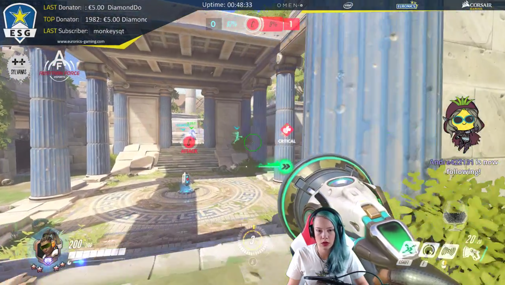

OBS is Open Broadcaster Software. It's latest version, OBS Studio, is in now on version 19.0.3. Installer downloads are available for Mac and Windows, and repositories are available for a variety of Linux flavors.

## What is OBS Studio

OBS is, from the website, "Free and open source software for video recording and live streaming." OBS allows the user to record multiple sources simultaneously: webcams, the desktop, even individual windows. OBS combines the sources and streams the output to services like twitch.tv and facebook live. Users can "Share [their] gaming, art and entertainment with the world"

## Who uses OBS

Streaming to twitch.tv is extremely popular. Watching these streams is also popular. At any given time, close to a million people are watching live, while thousands are streaming. Mostly, they stream videogames. OBS is one of the most popular tools for streaming to twitch.tv. Chantal "Sylvanas" Frey is a streamer from Germany. She streams to twitch.tv four to five times a week, usually playing the game Overwatch. Asked how many hours she has used OBS for, she can't quantify the number:  "been streaming for 2.5 years now, sooo many hours haha."

Figure 3: Chantal "Sylvanas" Frey playing Overwatch. She adds a webcam feed and some sponsor logos to her stream using OBS.

## Where does OBS come from

OBS is developed by a small team working in the open. Most of the code has been written by jp9000/Jim. Several other people have made serious contributions to the project.  OBS has a very active forums on the main website. The forums is where users post plugins that they have created.  OBS has a rich plugin ecosystem. The project has two very active IRC channels: '#obsproject' for user chat and support, and '#obs-dev' for developer chatter. Both of these IRC channels are on Quakenet. Users can click "Community Chat" on the website and be taken to a web bridge to quakenet where they can ask questions. A group of helpful (and handsome) support volunteers try to answer questions and help the users solve their issues.

Figure 3: Users who click 'use chat' on the OBS website must agree to be polite before they are joined to quakenet over a web bridge.

## Sources

Caroline "omgVandi" Vani is a freelance graphic designer and streamer on Twitch. As part of her graphic design business she designs graphics and overlays for streamers. Streamers use OBS combined with staic grahpics and animated browser sources to create good looking streams.

OmgVandi says that most OBS scenes are constructed out of a few basic sources:

* Webcam video source: "A lot of people will have a greenscreen. Some people have the straight camera box, but if they do, they have a real life background that fits the style of the stream. The background of the camera becomes a relevant part of the stream." 
* Game capture. OBS can capture fullscreen games, windowed gaems, or the raw desktop.
* A browser source that displays new followers, new donations, and subscriptions. Browser sources are dynamic web content rendered onto the stream. 
* Static or animated graphics to provide borders and branding: "My job as a graphic designer is to ... create the visuals that go into browser sources, or to create a static PNG overlay that goes on top". "Static PNG overlays are pretty standard for people that don't have a ton of money to spend on custom designs. They look really good, they're clean, most of them can be nice and simple," OmgVandi says. 

Figure 5: Stream screenshot from omgvandi. Note the box around her webcam and twitter and instagram tags. The border and social boxes(overlay assests) are created in graphics editing sotfware separately. Then OBS is used to layer the game, then the webcam source, then the overlay assets.

Figure 6: Stream screenshot from brotatoe. Advanced streamers usually have several OBS scenes. This is a screnshot from the 'Out of game' or 'Webcam focus' scene from popular streamer Brotato. The effort and quality put into the border graphics is plain to see. At the bottom of the scene, the graphics create (with the brown background) windows for dynamic content to be displayed. Brotato is using dynamic web content to display the names and values of his most rescent supporters. The upside-down cup in the corner is also a browser source - a virtual tip jar called a 'bit cup'.

## What is different about OBS

OBS has a huge and engaged user base, especially relative to the size of the developement team. This is a project with one main developer, a few other volunteers, and no one getting paid for their work. The windows version of 19.0.2 has been downloaded from github 2.3 million times in 26 days since it's release. The 19.0.3 version has been downloaded over a hundred thousand times in less than two days. The official twitter account has 90,000 followers.

When DD-WRT first came out, one of the lines was 'turn your $50 router into a $5000 router.' The explanation was that with this piece of software you could get features that were only available in professional, expensive devices. This is essentially what OBS is doing. OBS gives the streamer tons of control over the broadcast. Control that until now hasn't been seen outside a professional TV network or sports broadcast.

OBS is exciting for three reasons. 

One: Technically, it is really cool. What it can do and what the user can do with it is flat out impressive.

Two: In this age of corporations throwing dozens of developers at OpenStack, Docker and kubernetes; startups with open core products; and declining support for core FLOSS software, it is encouraging to see a small, self-sustaining, and successful project - let alone a desktop app project.

Three: OBS is, as the gamers would put it, hype. 90k twitter followers, companies putting 'Works with OBS' in their product marketing, antivirus companies working with OBS on whitelisting, etc. This project has a large excited userbase, most of whom aren't selecting it based on license.  Just look at some of these tweets. We asked Sylvanas "Did you know OBS is Open Source? What does that mean to you?" Her response: "never thought about it."

* https://twitter.com/laserring/status/873037202862645256
* https://twitter.com/OGBUSTA/status/866085482945490945
* https://twitter.com/kayosgirl86/status/859529074984792065
* https://twitter.com/Omega6ixx/status/843966705185443840
* https://twitter.com/FragManSaul/status/836489151679709185
* https://twitter.com/nathaniastv/status/865264972456108033

* omgVandi stream - Twitch.tv/omgvandi
* Brotatoe stream - Twitch.tv/brotatoe
* Sylvanas stream - Twitch.tv/sylvanas_sc2
* Overwatch is a registered trademark of Blizzard Entertainment

If you'd like to contract omgVandi to create some graphics for your stream, you can DM her over Twitter at @omgvandi, or send an email at cvani@rogers.com.

